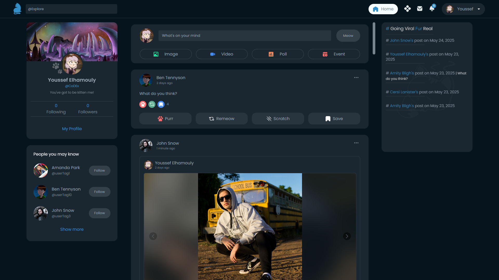
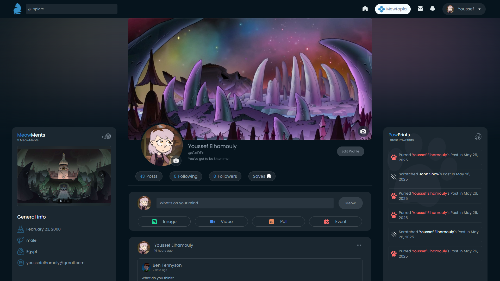
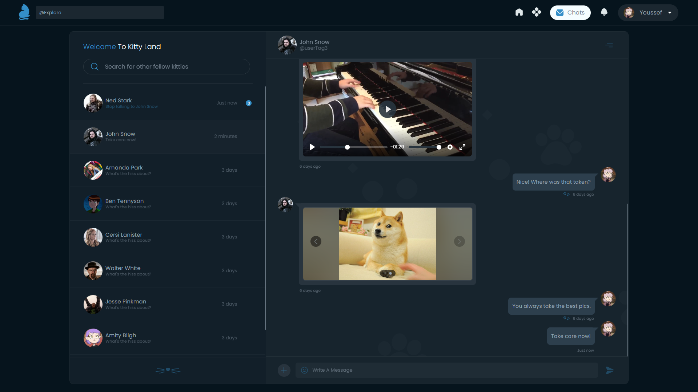
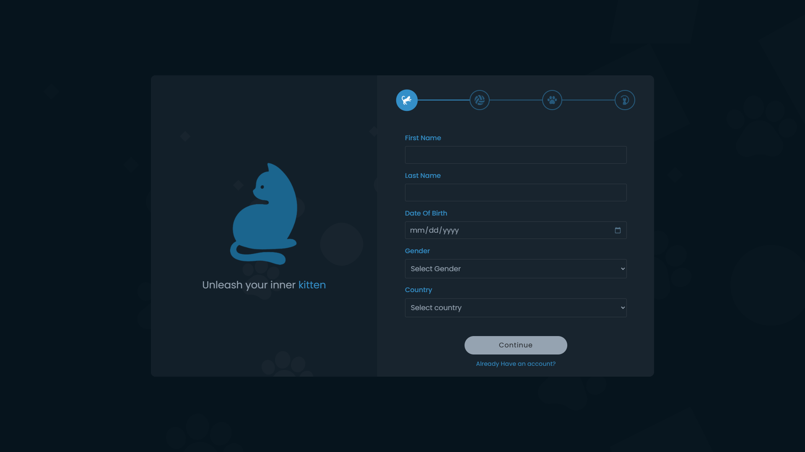

# 🐾 Mittens

**Mittens** is a comprehensive full-stack social media platform designed exclusively for cat enthusiasts. It provides a modern social experience with real-time features that allow users to share posts, engage interactively, and communicate instantly via chat—all within a thoughtfully curated, cat-themed environment.

---

## 🌟 Features

- 😺 User Profiles
- 🐾 Posts supporting Images, Videos, Polls, and Events
- ❤️ Real-Time Interactions including Likes, Saves, Remeows, and Comments
- 💬 Real-Time Chat

---

## 📁 Project Structure

```
client/
├── src/
│   ├── APIs/
│   ├── components/
│   ├── pages/
│   ├── Redux/
│   ├── utils/
│   ├── sass/
│   └── ...
├── index.html
├── vite.config.js
└── ...

server/
├── controllers/
├── models/
├── middlewares/
├── routes/
├── redis/
├── views/
├── utils/
├── socket.js
├── server.js
└── ...


```

---

## 🖼️ Screenshots

<p align="center">
  
  
</p>
<p align="center">
  
  
</p>

---

## 🧰 Tech Stack

### MERN Stack (MongoDB, Express, React, Node.js)

- **Frontend:**

  - React — Modular, component-driven architecture
  - Sass — CSS preprocessor for modular styles

- **Backend:**
  - Node.js & Express — Robust server environment and API routing
  - MongoDB — Scalable NoSQL document database
  - Redis — In-memory cache and Socket.io management
  - Socket.io — Event-driven, bidirectional real-time communication
